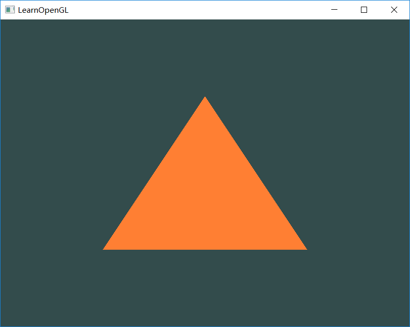
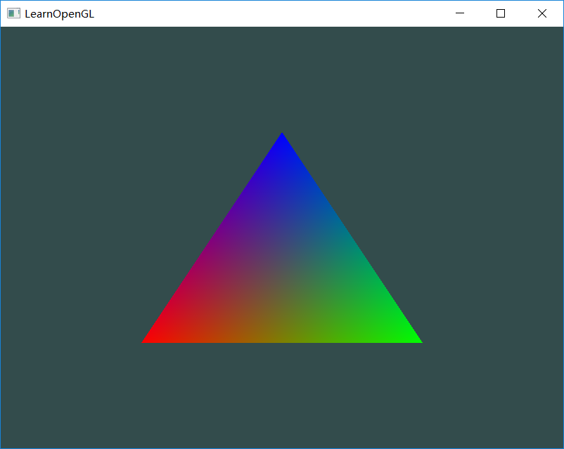
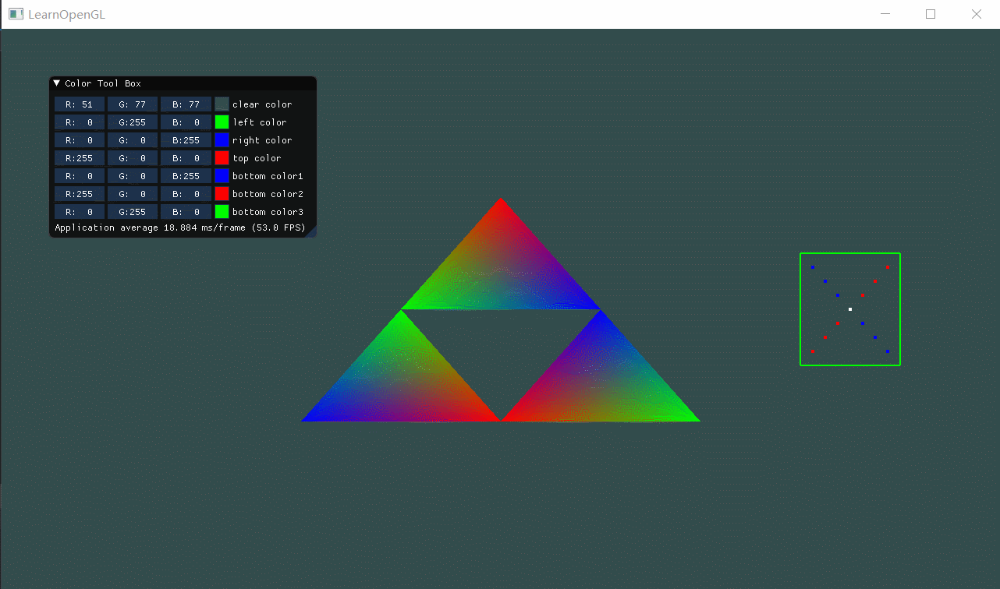

| 课程名称 | 计算机图形学 | 任课老师 | 高成英 |
| :------------: | :-------------: | :------------: | :-------------: |
| 年级 | 16级 | 专业（方向） | 软件工程（数字媒体）|
| 学号 | 16340255 | 姓名 | 谢涛 |
| 电话 | 13670828568 | Email | 1176748429@qq.com |
| 开始日期 | 2019-03-08 | 完成日期 | 2019-03-11 |

## Basic

1. 使用OpenGL(3.3及以上)+GLFW或freeglut画一个简单的三角形。
效果图：

2. 对三角形的三个顶点分别改为红绿蓝。并解释为什么会出现这样的结果。
效果图：

3. 给上述工作添加一个GUI，里面有一个菜单栏，使得可以选择并改变三角形的颜色。
效果图（见Bonus）

## Bonus

1. 绘制其他的图元，除了三角形，还有点、线等。 
2. 使用EBO(Element Buffer Object)绘制多个三角形。 

动态效果图：

## 作业要求： 
1. 把运行结果截图贴到报告里，并回答作业里提出的问题。 
2. 报告里简要说明实现思路，以及主要function/algorithm的解释

## 实现思路
1. **开发环境配置**
配置过程这里就不赘述，比较繁琐，网上有教程。不过有个地方弄了很久，就是ImGui一直编译报错，需要自己手动添加它需要的库，但编译通过之后老是会在ImGui_ImplOpenGL3_NewFrame()时卡在ImGui_Impl_OpenGL3_CreateDeviceObjects()函数中，提示读写位置异常。后面发现把opengl3.h里面的包含gl3w.h改成glad.h就正常了。
2. **Basic**
一个简单的三角形及对应顶点着色。在此之前需要了解许多准备知识，可以说是hello world门槛较高了。这个实现主要是按着教程网站来的，从创建窗口开始练习，熟悉了下OpenGL的使用方法，一直到小三角形，渐渐深入了解渲染过程。
要绘制这个三角形主要是要了解图形渲染管线的流程，其中对我们最重要的是顶点着色器和片段着色器。前者负责接受从CPU传来的顶点数据，这些顶点数据就是我们定义的三角形顶点的位置以及属性，属性可以包括颜色等。后者就是对前面的片段进行着色，颜色可以是直接在对应着色器的gsgl源程序中写死，也可以让前一步输出一个颜色作为一个输入，利用这个输入的颜色进行操作。这就意味着可以从顶点着色器中将顶点数据的属性（颜色部分）传递到片段着色器，从而渲染出三个顶点的颜色。
但是为什么我们只定义了三个颜色，为什么会出来一个像调色板一样色彩丰富的三角形。我想应该是光栅化阶段，将图形分为了很多小块或是像素，在后面的着色阶段，则是以这些像素为单位进行渲染。每个像素颜色值或是小块的颜色值都是单独计算的，而计算的依据应该是其周围像素的颜色计算，和远近有关。从宏观上来看，如果是一条线段，如果线段两端是两个颜色A和B，那么线段中部的颜色就是0.5A+0.5B，线段上的所有点应该也是按这种线性加权的方式计算。
3. **ImGui**
虽然在配置过程中遇到了点坑，但是总体还是很好用的，轻量、方便且常用的组件应有尽有，可以说是麻雀虽小五脏俱全。有许多基本的GUI元件如输入框、按钮、滑动条和颜色选择器等。我这里主要使用的就是将颜色选择器绑定到各个顶点的颜色变量以调节颜色。
4. **Bonus**
绘制其他图元的话只需要改一下绘制函数的参数，如glDrawArrays。第一个参数可以传入预定义好的GL常量，如GL_TRIANGLES对应三角形，GL_LINE_STRIP对应线段，GL_POINTS对应点。第二个参数可以指定从array的第几个数据开始画，最后一个参数指定画多少个顶点。
值得一提的是EBO，最大的好处就是复用顶点，减少计算机渲染重复顶点的额外开销。不过复用有时也一些限制，就是要复用的顶点必须完全复用其所有属性，包括其颜色等。所以像我前面做的效果图，复用的顶点颜色被调节的时候，会导致两个三角形的颜色都产生变化。

## 主要的function解释
1. glfwCreateWindow(width, height, title, ..., ...);
该函数用来创建窗口，它会返回一个窗口对象，是基本界面。主要是前三个参数，分别是宽、高和窗口的标题。
2. glfwMakeContextCurrent(window);
创建完窗口我们需要通知GLFW将我们窗口的上下文设置为当前线程的主上下文。
3. glViewport(x, y, width, height);
该函数用于定义视口大小。函数前两个参数控制窗口左下角的位置。第三个和第四个参数控制渲染窗口的宽度和高度（像素）。
4. glfwTerminate();
释放资源。
5. glClearColor与glClear
前者设置清屏颜色，后者设置清屏模式。
6. glCreateProgram();
创建程序对象。
7. glAttachShader(shaderProgram, xxxShader);
把着色器附加到程序对象上。
8. glLinkProgram(shaderProgram);
把这些着色器链接起来。
9. glUseProgram(shaderProgram);
启用程序对象。
10. glDeleteShader(xxxShader);
删除着色器对象。
11. glVertexAttribPointer(0, 3, GL_FLOAT, GL_FALSE, 3 * sizeof(float), (void*)0);
顶点属性指针，指定由顶点数组中哪些项构成某一个属性，这些项通常都是等间距的。
- 第一个参数指定我们要配置的顶点属性组。
- 第二个参数指定顶点属性的大小。
- 第三个参数指定数据的类型。
- 第四个参数定义是否希望数据被标准化。
- 第五个参数是步长，即在连续的顶点属性组之间的间隔。
- 最后一个参数的类型是表示位置数据在缓冲中起始位置的偏移量(Offset)。
12.  glEnableVertexAttribArray(int);
启用某个属性组，即对应前面的第一个参数。
13. glBindVertexArray(VAO);
绑定VAO，随后才可以进行VBO的绑定和顶点属性指针的配置。当参数是0时，代表解绑。
14. glDrawArrays(GL_TRIANGLES, 0, 3);
画图形。
- 第一个参数代表图元类型，可以是三角形、线段、点。
- 第二个参数指定第一个要画的顶点在顶点数组的下标索引。
- 第三个参数指定要画多少个顶点。
15. glDrawElements(GL_TRIANGLES, 6, GL_UNSIGNED_INT, 0);
画图形，专用于EBO。
- 第一个参数代表图元类型。
- 第二个参数代表要画的顶点个数。
- 第三个参数代表顶点索引的数据类型。
- 最后一个参数是偏移量。 

