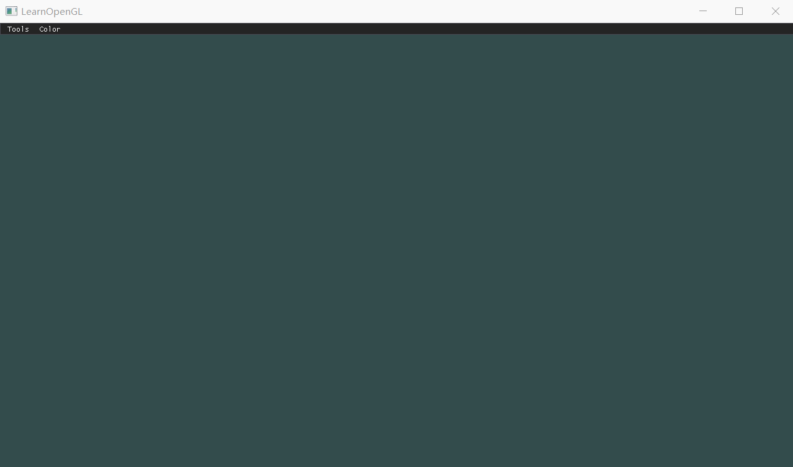
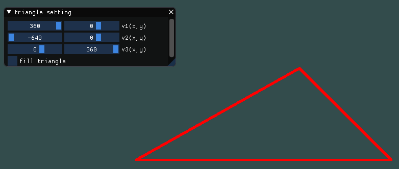
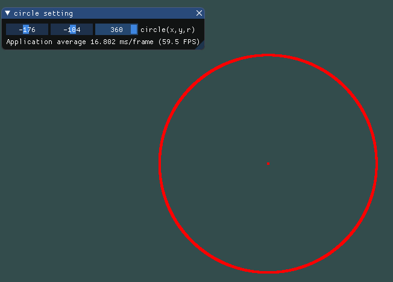
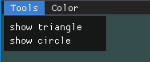
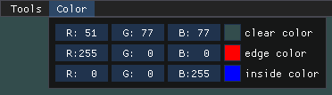
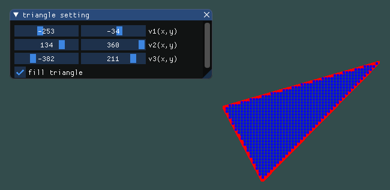

| 课程名称 | 计算机图形学 | 任课老师 | 高成英 |
| :------------: | :-------------: | :------------: | :-------------: |
| 年级 | 16级 | 专业（方向） | 软件工程（数字媒体）|
| 学号 | 16340255 | 姓名 | 谢涛 |
| 电话 | 13670828568 | Email | 1176748429@qq.com |
| 开始日期 | 2019-03-23 | 完成日期 | 2019-03-25 |

## Basic

1. 使用Bresenham算法(只使用integer arithmetic)画一个三角形边框：input为三个2D点；output三条直线（要求图元只能用 GL_POINTS ，不能使用其他，比如 GL_LINES 等）。 

2. 使用Bresenham算法(只使用integer arithmetic)画一个圆：input为一个2D点(圆心)、一个integer半径； output为一个圆。 

3. 在GUI在添加菜单栏，可以选择是三角形边框还是圆，以及能调整圆的大小(圆心固定即可)。

## Bonus

1. 使用三角形光栅转换算法，用和背景不同的颜色，填充你的三角形。

## 作业要求： 
1. 运行结果录制GIF
动态效果图：
2. 把运行结果截图贴到报告里，并回答作业里提出的问题。 
3. 报告里简要说明实现思路，以及主要function/algorithm的解释

## 实现思路

1. Bresenham直线算法。
- 核心思想：将不在格点上的点用最近的格点表示。判断最近格点的时候可以通过决策参数p来决定，p便是根据前面提到的最近原则推导而来的，推导过程就不做解释了。计算都是纯整数加减法，速度快。需要注意的地方是，应对斜率分类讨论，|k|<=1、|k|>1以及k不存在时。
- 伪代码（以下只展示|k|<1情况的，|k|>1时只需交换x和y，k不存在时特殊处理即可）：
```
drawPoint(x1, y1)
initialize:
    dx=x2-x1
    dy=y2-y1
    p=2*dy-dx
    x = x1
    y = y1
while (x != x2) {
    if p <= 0 {
        x++
        drawPoint(x, y)
        p += 2*dy
    }
    else {
        x++
        y++
        drawPoint(x, y)
        p += 2*(dy-dx)
    }
}
drawPoint(x2, y2)
```
- 有了画直线函数，三角形依次画三条线即可。


2. Bresenham画圆算法。
- 核心思想：也是将不在格点上的点用最近的格点表示。通过决策参数以及圆的几何性质（8对称性，知一求八）决定要画的格点。为了避免多余的计算，我是默认先假设圆心在原点计算出每轮的八个点后根据实际圆心再做偏移描点。
- 伪代码
```
initialize:
    let (xc, yc) be the center point, and r be the radius
    x = 0
    y = r
    p = 3 - 2 * r;
while (x <= y) {
    get eight points postion:
        point1: x, y,
        point2: y, x,
        point3: y, -x,
        point4: x, -y,
        point5: -x, -y,
        point6: -y, -x,
        point7: -y, x,
        point8: -x, y
    for each point above:
        // set offset
        point.x += xc
        point.y += yc
        drawPoint(point)
    if (p < 0) {
        p += 4 * x + 6;
    }
    else {
        p += 4 * (x - y) + 10;
        y--;
    }
    x++;
}
```
- 效果：
3. GUI菜单栏。调用ImGui的函数，模仿他的demo进行实现即可，这个比较简单。
- 解释一下菜单栏的功能：
    - Tools
        - Triangle settings
            - 三个顶点坐标slider调整
            - check box指示是否填充三角形
        - Circle settings
            - 圆心坐标及半径slider调整
        - 效果：  
        
    - Color
        - clear color：选择清屏颜色
        - edge color：选择边的颜色
        - inside color：选择填充的颜色
        - 效果：  
        

4. 填充三角形。
- 核心思想：这里我是采用edge_equations的方法，即通过计算边的表达式，遍历外接矩形中的每一个点，如果点在三条边的同一侧则画出该点。这里做了一些优化：
    - 利用两点式推导成一般式，可以规避所有特殊情况，且计算方便。
    - 考虑了向量反转的情况，视将点代进三边一般式得到相同符号即为在内部。要注意的是，三条边顺序必须依次形成一个闭合向量，否则该判断方法无效。
    - 为了提高渲染速度，增大了填充点的间隔，以及点的大小，流畅很多。
- 圆的填充比三角形填充简单许多，可以直接根据圆心和半径判断是否在内部。因此这里就没有额外做圆的填充。
- 伪代码：
```
initialize:
    int v1v2_dx = v2.x - v1.x;
    int v1v2_dy = v2.y - v1.y;
    int v2v3_dx = v3.x - v2.x;
    int v2v3_dy = v3.y - v2.y;
    int v3v1_dx = v1.x - v3.x;
    int v3v1_dy = v1.y - v3.y;
    // line: x*dy-y*dx+(y1*dx-x1*dy)=0
    // that is: A=dy, B=-dx, C=(y1*dx-x1*dy)
    int lines[3][3] = {
        v1v2_dy, -v1v2_dx, v2.y * v1v2_dx - v2.x * v1v2_dy, // line1: v1---v2
        v2v3_dy, -v2v3_dx, v3.y * v2v3_dx - v3.x * v2v3_dy, // line2: v2---v3
        v3v1_dy, -v3v1_dx, v3.y * v3v1_dx - v3.x * v3v1_dy  // line3: v3---v1
    };
get bound box of the triangle
for each point in box:
    if the point is inside of the triangle:
        //the inside is defined as: on the same side of all edges
        drawPoint(point)
```
- 效果：  


## 主要的function/algorithm解释
- 核心algorithm已在上面介绍，下面简要介绍一些functions。
- drawPoint(point, color): 画点。其中point为要画的点，color是要渲染的颜色。
- drawLine(v1, v2): 画线。其中两个参数是确定直线的两个顶点。本函数会调用drawPoint(point, color)。
- drawTriangle(v1, v2, v3): 画三角形。参数为三个顶点。本函数会调用三次drawLine(v1, v2)。
- drawCircle(x, y, r): 画圆。参数为圆心x坐标、y坐标以及半径。
- bound(v1, v2, v3，box): 获取三角形的外接矩形的四个顶点。
- inside(lines, point): 根据边的方程和传入的点判断点是否在三角形内部，返回一个bool值。判断的逻辑是，将点分别代入三个方程，是否具有相同的符号，即是否在三边的同一侧，是的话就是inside。
- rasterize(v1, v2, v3): 光栅化填充三角形。参数是三个顶点。本函数会调用bound和inside等函数，扫描填充。
