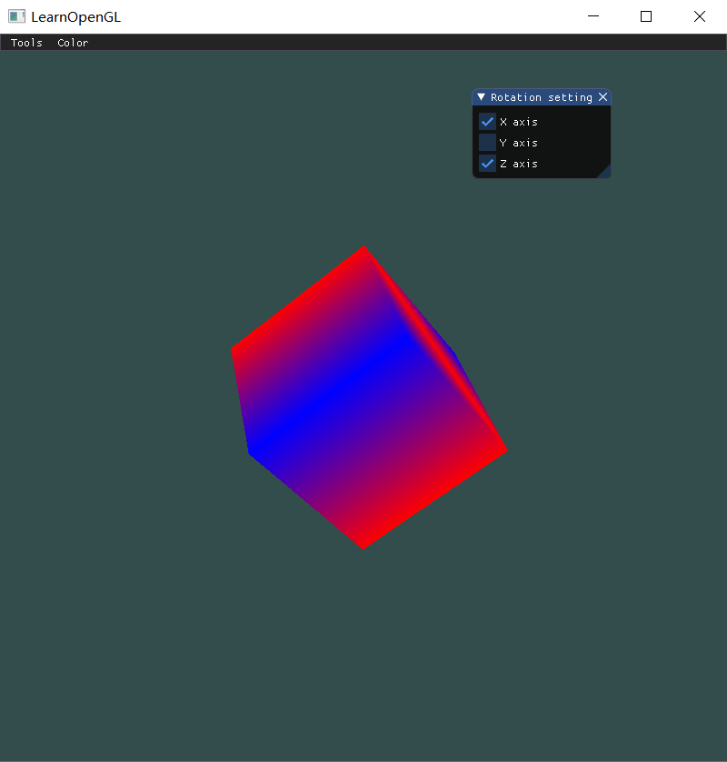
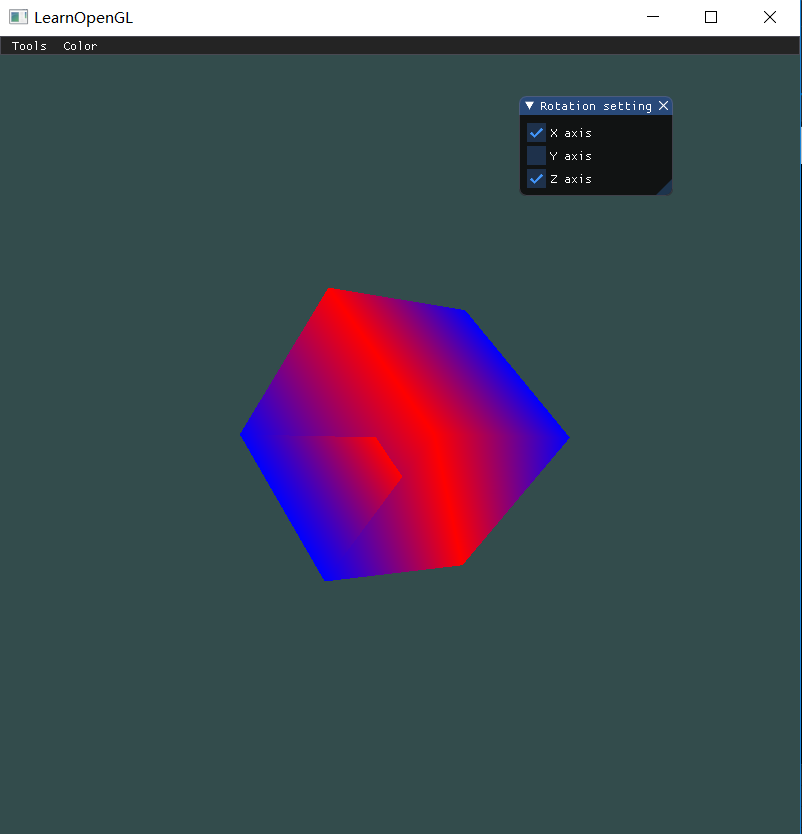
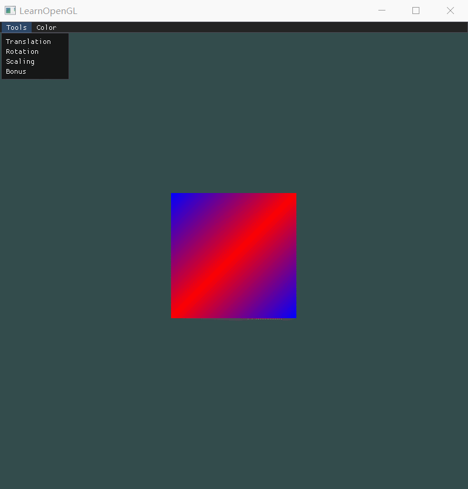
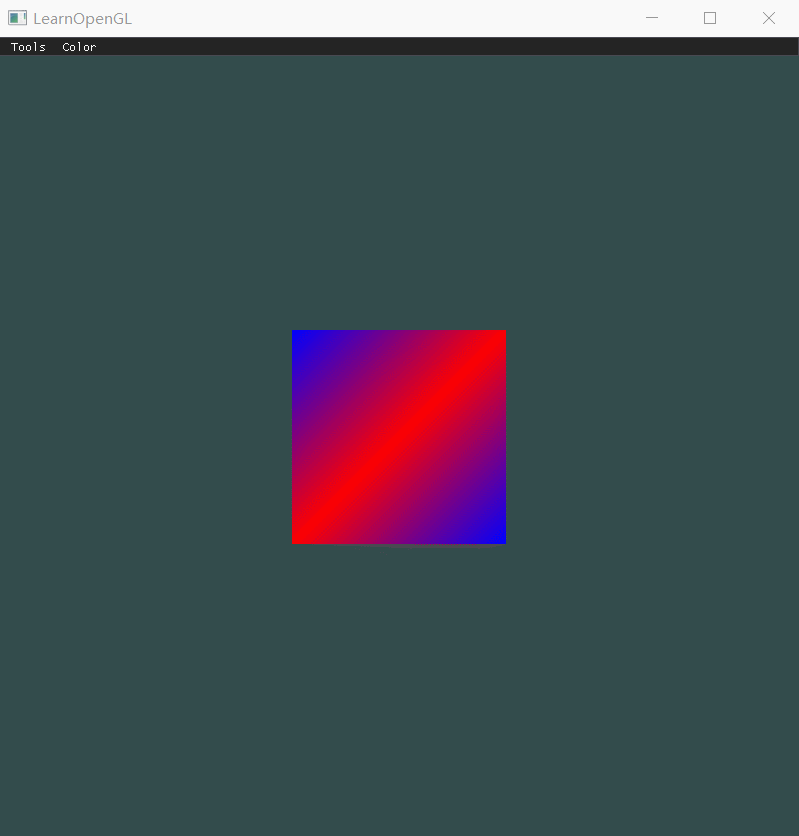

| 课程名称 | 计算机图形学 | 任课老师 | 高成英 |
| :------------: | :-------------: | :------------: | :-------------: |
| 年级 | 16级 | 专业（方向） | 软件工程（数字媒体）|
| 学号 | 16340255 | 姓名 | 谢涛 |
| 电话 | 13670828568 | Email | 1176748429@qq.com |
| 开始日期 | 2019-04-06 | 完成日期 | 2019-04-09 |

## Basic
1. **画一个立方体(cube)：边长为4，中心位置为(0, 0, 0)。分别启动和关闭深度测试 glEnable(GL_DEPTH_TEST) 、 glDisable(GL_DEPTH_TEST) ，查看区别，并分析原因。**
- **启动深度测试。**

- **关闭深度测试**

- **原因。** 对比后可以看出，关闭深度测试的时候立方体看起来很奇怪，就像似乎能透视又不全能透视。真正的原因是立方体画的时候是一个三角形一个三角形画出来的，在没有启用深度测试的时候，opengl不会记录深度信息，后面画的三角形就会覆盖前面画的三角形，从而变成有些透明有些不透明的情况，这跟三角形的渲染顺序息息相关。OpenGL将深度信息存储在Z缓冲(Z-buffer)中，它允许OpenGL决定何时覆盖一个像素而何时不覆盖。

2. **平移(Translation)：使画好的cube沿着水平或垂直方向来回移动。**

3. **旋转(Rotation)：使画好的cube沿着XoZ平面的x=z轴持续旋转。**

4. **放缩(Scaling)：使画好的cube持续放大缩小。**

5. **在GUI里添加菜单栏，可以选择各种变换。**
如前面的gif中所示。

6. **结合Shader谈谈对渲染管线的理解。**
渲染管线所作的工作，就是解决如何将一个3d模型经过一系列变换和处理后，显示在2d屏幕上，是这个2d图形看起来有3d的效果。渲染管线的流程大致分为顶点处理、面处理、光栅化、像素处理。各种着色器在管线流程中都起着很重要的作用。
- 在顶点处理中，vertex shader，即顶点着色器，起着主要作用。它负责接收用户传给gpu的顶点数据，顶点数据是一种属性，可以包括位置、颜色、纹理等常见属性，也可以是自定义属性。在 vertex shader 中可以对这些数据进行操作，比如本次作业中使用的 mvp 变换，可以实现opengl中各种坐标系的变换，如平移、旋转、缩放、视角切换以及投影等。这一部分就属于管线流程中的顶点处理部分，一般的变换过程为：**本地坐标系 => 世界坐标系 => 视图坐标系 => 投影坐标系**。顶点处理除了包括坐标变换，还包括雾化、材质和光照等属性的处理。
- 在面处理中，主要经过面的组成、面的截取和面的去除。也就是将点连成线，线构成面，然后对超出显示范围的区域进行裁剪。
- 光栅化阶段，在前几次作业也接触过不少，通俗说就是将面处理中得到的初步的“面”进行分割，以方便颜色的填充和材质的渲染。
- 像素处理阶段，则是对光栅化后得到的许多小格子即像素区域进行像素粒度的填充，可以是普通的整块颜色或者过度颜色的填充，也包括纹理和贴图处理等。

# Bonus
实现的是模仿地球绕太阳转，立方体模拟地球，绕自身(1,1,0)轴自转的同时绕世界坐标的(0,1,0)公转，世界坐标原点即为太阳。

## 作业要求： 
1. 把运行结果截图贴到报告里，并回答作业里提出的问题。 
2. 报告里简要说明实现思路，以及主要function/algorithm的解释。 
3. 虽然learnopengl教程网站有很多现成的代码，但是希望大家全部手打，而不是直接copy。

## 实现思路
平移、旋转、缩放这些都是调库的事情，glm就能很好的解决。本次作业的难点主要是理解 mvp 变换是一个怎样的过程。前面有提到是一个 **本地坐标系 => 世界坐标系 => 视图坐标系 => 投影坐标系** 的过程。这里补充一下为什么要做这样转换。首先对于一开始的要求 “边长为4”，在没接触mvp时不知道怎么设置，因为屏幕坐标就是-1到1，边长为4就超出范围了，所以只能是对正方体转换个视角，再把正方体在z方向上拉远一点，就能看见全貌了，这是需要mvp做视图转换的第一个原因。其次是要把局部坐标跟世界坐标区分开，方便实现类似地球自转（局部坐标系）+公转（世界坐标系）的功能。然后是正方体需要有立体视觉，也就是透视，比如不是正对着正方体的时候，就应该能看到不仅限于正方体正面的那四个顶点，这个便需要投影坐标系来完成。

## 主要的function/algorithm解释
- **glm::mat4(1.0f)。** 生成一个4*4的单位矩阵，用于配合后面的变换函数生成变换矩阵。
- **glm::translate(mat4, glm::vec3)。** 传入一个三维向量表示位移量，glm根据这个位移量，并在mat4的基础上，加入位移变换，生成新的矩阵并返回。
- **glm::rotate(mat4, radius, vec3)。** 第二个参数是旋转角度，第三个参数是旋转轴，glm根据旋转角度和旋转轴，在mat4基础上加入旋转变换，生成新的矩阵并返回。
- **glm::scaling(mat4, vec3)。** 第三个参数是缩放因子，分别指定x、y、z三个方向上的缩放比例，也是在mat4的基础上加入缩放变换，生成新的矩阵并返回。
- 以上变换均可叠加。
- **glGetUniformLocation(shaderProgram, uniformName)。** 这个函数返回着色器程序中uniform变量的地址，如果没有找到返回-1。第一个参数是链接后的着色器程序的id（不是顶点着色器的id，一开始传错参数坑了很久）。第二个参数是要找的uniform变量的名称。
- **glUniformMatrix4fv(uniformLocation, count, transpose, address)。** 该函数的作用是对着色器程序中uniform变量的赋值。第一个参数是上个函数返回的uniform变量在着色器程序中的地址，第二个参数表示要改变的uniform变量的个数，传1表示要修改的uniform变量不是数组。第三个参数是布尔类型，指定传进去的变换矩阵是否要做转置。第四个参数则是要传进去的变换矩阵的地址。