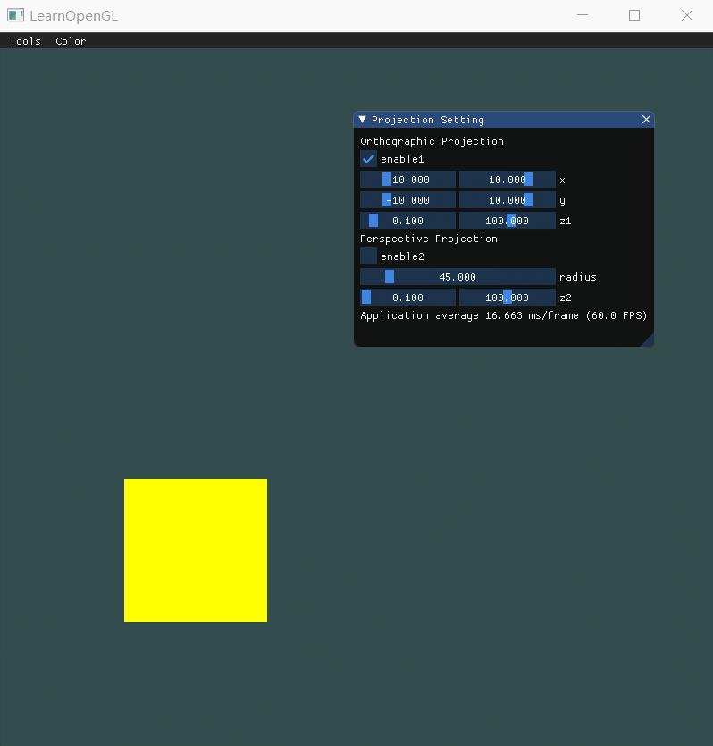
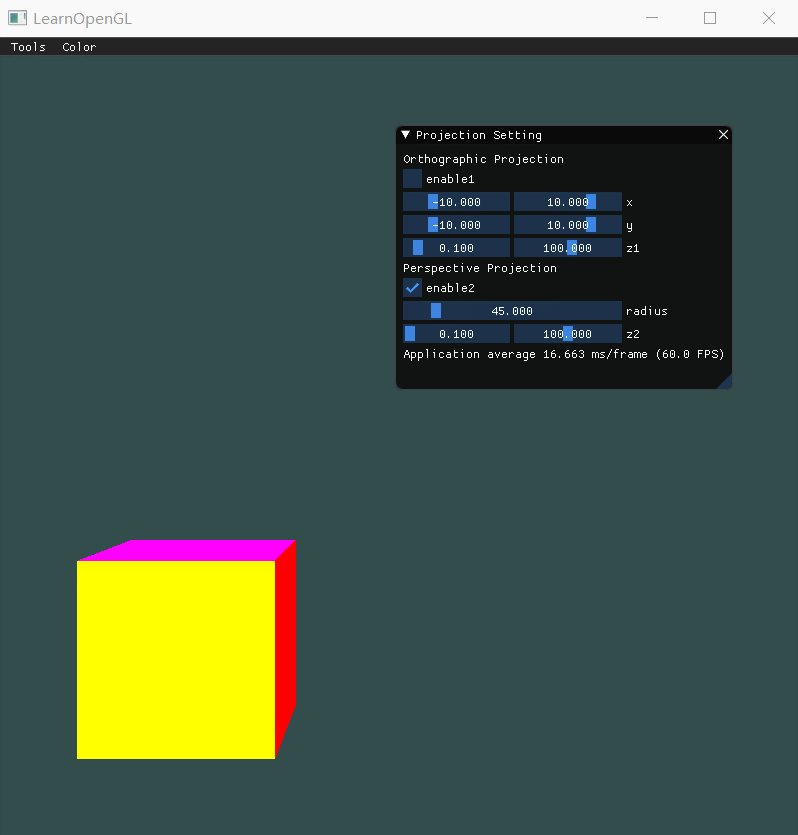
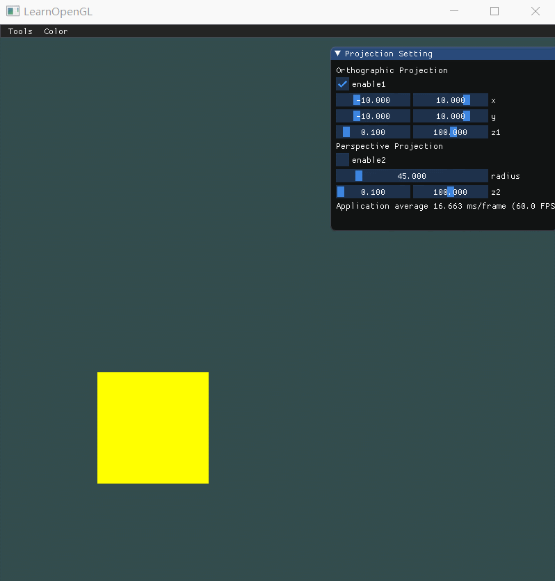

| 课程名称 | 计算机图形学 | 任课老师 | 高成英 |
| :------------: | :-------------: | :------------: | :-------------: |
| 年级 | 16级 | 专业（方向） | 软件工程（数字媒体）|
| 学号 | 16340255 | 姓名 | 谢涛 |
| 电话 | 13670828568 | Email | 1176748429@qq.com |
| 开始日期 | 2019-04-13 | 完成日期 | 2019-04-15 |

## Basic
**1. 投影(Projection):**
- 把上次作业绘制的cube放置在(-1.5, 0.5, -1.5)位置，要求6个面颜色不一致
- 正交投影(orthographic projection)：实现正交投影，使用多组(left, right, bottom, top, near, far)参数，比较结果差异
- 透视投影(perspective projection)：实现透视投影，使用多组参数，比较结果差异 

**2. 视角变换(View Changing): 把cube放置在(0, 0, 0)处，做透视投影，使摄像机围绕cube旋转，并且时刻看着cube中心。**

**3. 在GUI里添加菜单栏，可以选择各种功能。**
Hint: 使摄像机一直处于一个圆的位置，可以参考以下公式：
原理很容易理解，由于圆的公式 `a^2+b^2=1` ，以及有 `sin(x)^2+cos(x)^2=1` ，所以能保证摄像机在XoZ平面的一个圆上。

如上面两幅动图展示的菜单栏。（颜色调整没有展示，可分别调整六个面的颜色）

**4. 在现实生活中，我们一般将摄像机摆放的空间View matrix和被拍摄的物体摆设的空间Model matrix分开，但是在OpenGL中却将两个合二为一设为ModelView matrix，通过上面的作业启发，你认为是为什么呢？在报告中写入。**
现实中我们既能移动物体，也能移动摄像机，所以逻辑上我们会习惯将model和view区分开，而在opengl中，实际上是没有摄像机这个概念，只能认为摄像机固定在世界原点（0，0，0），始终朝着（0，0，-1）的方向看。但我们会发现，移动物体和移动摄像机其实本质上都是一种类似的平移动作，只是刚好反过来。比如你想把摄像机往后靠一点，其实你也可以把整个场景往远处移一点，达到的效果是相同的。所以opengl会把model和view合起来。

# Bonus
实现一个camera类，当键盘输入 w,a,s,d ，能够前后左右移动；当移动鼠标，能够视角移动("look around")， 即类似FPS(First Person Shooting)的游戏场景 Hint: camera类的头文件可以参考如下（同样也可以自己定义，只要功能相符即可）。

## 作业要求： 
1. 把运行结果截图贴到报告里，并回答作业里提出的问题。 
2. 报告里简要说明实现思路，以及主要function/algorithm的解释。 
3. 虽然learnopengl教程网站有很多现成的代码，但是希望大家全部手打，而不是直接copy。

## 实现思路

- 本次作业和上次作业很相似，主要需要的知识上次作业已有所涉及，也是主要是理解 mvp 变换是一个怎样的过程，即 **本地坐标系 => 世界坐标系 => 视图坐标系 => 投影坐标系**。
- 本次作业略有不同的地方是，对比了一下正交投影和透视投影。通过第一题的比对，可以很显然的发现他们之间的区别。某种程度上，正交投影可以认为是平行光源下物体的视角，透视投影则是点光源下物体的视角。
    - 正交投影的六个参数，分别是x、y、z各一对，描述了一个可视区域，只有物体在这个区域内才看得见。通过第一题的动图，我们会发现调整参数的时候物体还会被拉长或压扁，这是因为窗口可见的范围便是可视区域，因此在调整可视区域长宽比例的时候（物体边长未变），所以物体的长宽比例会发生变化。如果交换一下x、y、z一对参数的位置（左右交换、上下交换、远近交换），还可以产生镜像的效果。
    - 透视投影的主要参数是视角。在物体距离摄像机位置不变，边长不变的情况下，且视角小于180°时，视角越大物体看起来就越小，超过180°后物体会颠倒，随着视角变大物体看起来变大。
    - ps：在我的实现下，题目要求的那个位置并不能很好地看出正交投影和透视投影的区别。因此我特地加多一个view变换，使得透视投影下能看到正方体的除正面4个角外的其他角。
- bonus涉及到欧拉角跟四元数的原理。虽然欧拉角会产生万向节死锁的问题，这个在上次作业我也有特地去了解过，当时看到一篇写得很好的博文，受益匪浅：[如何通俗地解释欧拉角?之后为何要引入四元数](https://wxn.qq.com/cmsid/WXN2019041400269200)。但由于本次作业需要实现的其实是一个类似FPS的视角，这是欧拉角擅长的地方，只要正常转动摄像机是不会触及到死锁的问题，所以本次还是选择使用欧拉角实现。
    - 描述欧拉角主要就需要三个参数，俯仰、偏航和桶滚，分别指定摄像机三个局部坐标轴的旋转跨度，且一般不会用到桶滚这一属性（绕局部z轴旋转），所以我们要关心的其实只有两个参数，俯仰（绕局部x轴旋转）和偏航（绕局部y轴旋转）。因此，根据这个原理，只要能追踪鼠标的坐标变化（鼠标坐标恰好就是x、y两个属性），就能计算出对应俯仰和偏航角度，从而将摄像机的角度与鼠标运动联系起来，实现类似FPS的效果。

## 主要的function/algorithm解释
- **glm::mat4(1.0f)。** 生成一个4*4的单位矩阵，用于配合后面的变换函数生成变换矩阵。
- **glm::translate(mat4, glm::vec3)。** 传入一个三维向量表示位移量，glm根据这个位移量，并在mat4的基础上，加入位移变换，生成新的矩阵并返回。
- **glm::perspective(mat4, width/height, near, far)。** 第一个参数是view矩阵，第二个参数是窗口的宽高比，前两个参数基本固定。后两个参数定义最近、最远能看到的平面的垂直距离。
- **glm::ortho(left, right, bottom, up, near, far)。** 六个参数两两成对，分别对应可视区域的x、y、z的极值点。
- **glm::lookAt(position, target, up)。** 该函数可以产生一个效果是始终看着某一点的view矩阵。三个参数都是一个glm::vec3类型的向量，分别指定摄像机的位置、观察目标和上向量（用于定位摄像机的角度）。
- **glGetUniformLocation(shaderProgram, uniformName)。** 这个函数返回着色器程序中uniform变量的地址，如果没有找到返回-1。第一个参数是链接后的着色器程序的id（不是顶点着色器的id，一开始传错参数坑了很久）。第二个参数是要找的uniform变量的名称。
- **glUniformMatrix4fv(uniformLocation, count, transpose, address)。** 该函数的作用是对着色器程序中uniform变量的赋值。第一个参数是上个函数返回的uniform变量在着色器程序中的地址，第二个参数表示要改变的uniform变量的个数，传1表示要修改的uniform变量不是数组。第三个参数是布尔类型，指定传进去的变换矩阵是否要做转置。第四个参数则是要传进去的变换矩阵的地址。