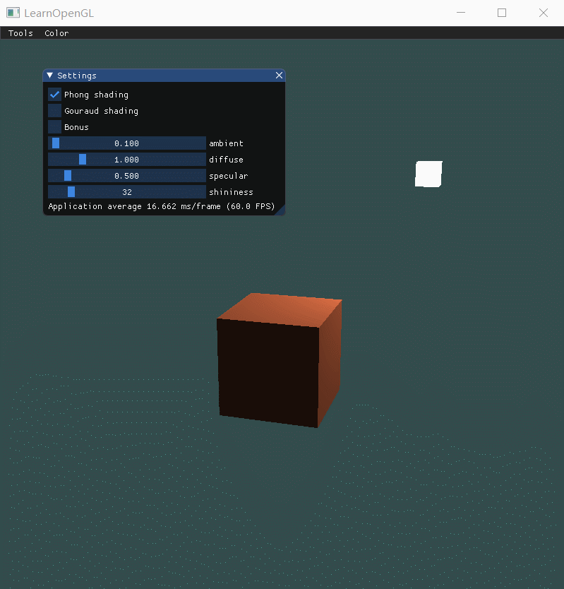
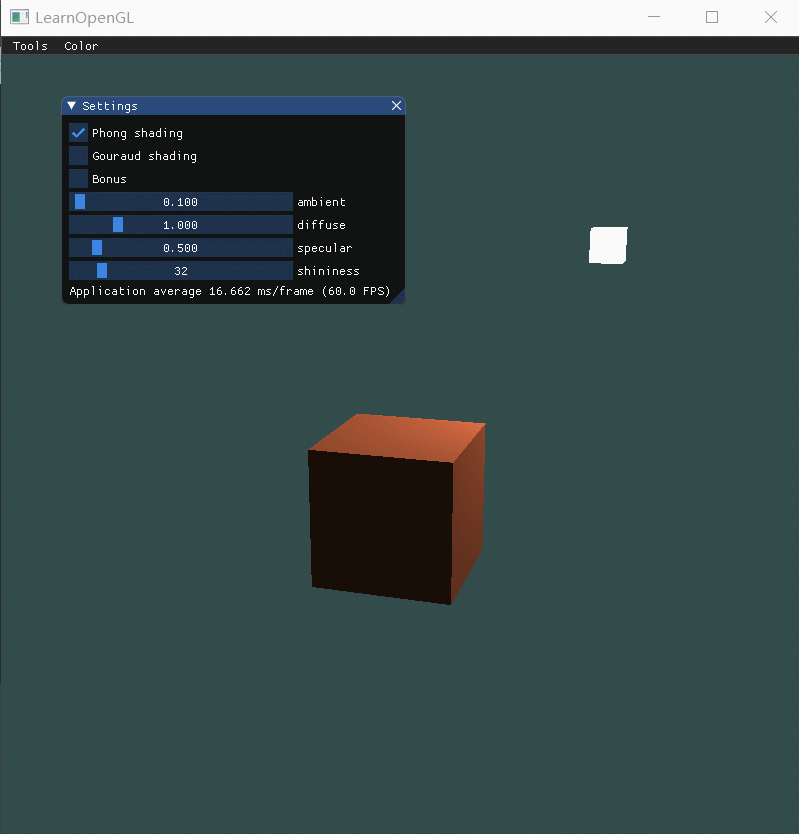
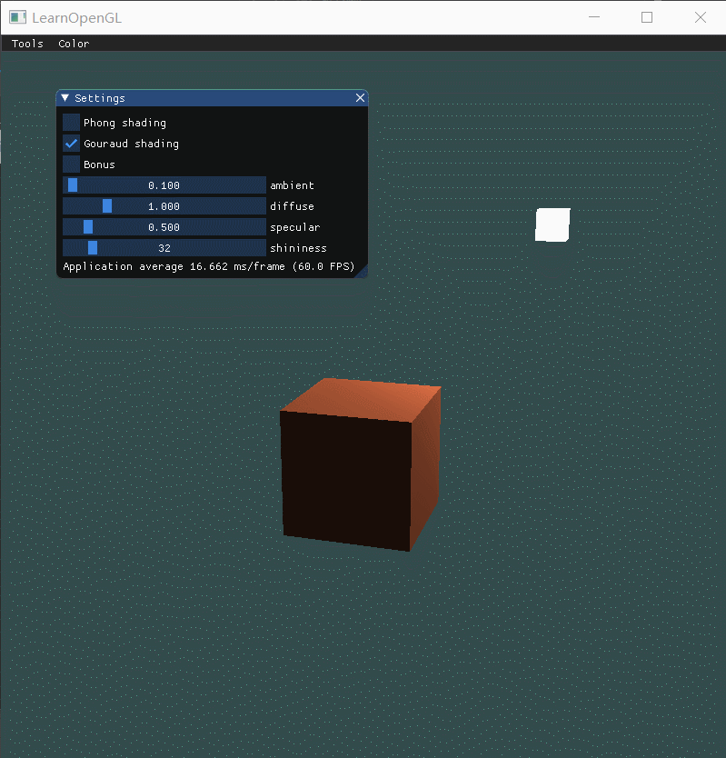

| 课程名称 | 计算机图形学 | 任课老师 | 高成英 |
| :------------: | :-------------: | :------------: | :-------------: |
| 年级 | 16级 | 专业（方向） | 软件工程（数字媒体）|
| 学号 | 16340255 | 姓名 | 谢涛 |
| 电话 | 13670828568 | Email | 1176748429@qq.com |
| 开始日期 | 2019-04-23 | 完成日期 | 2019-04-24 |

[TOC]

## Basic
1. 实现Phong光照模型： 
    - 场景中绘制一个cube
    - 自己写shader实现两种shading: Phong Shading 和 Gouraud Shading，并解释两种shading的实现原理
    - 合理设置视点、光照位置、光照颜色等参数，使光照效果明显显示 
2. 使用GUI，使参数可调节，效果实时更改： 
    - GUI里可以切换两种shading 
    - 使用如进度条这样的控件，使ambient因子、diffuse因子、specular因子、反光度等参数可调节，光照效果实时更改

## Bonus
当前光源为静止状态，尝试使光源在场景中来回移动，光照效果实时更改。 

## 作业要求 
1. 把运行结果截图贴到报告里，并回答作业里提出的问题。 
2. 报告里简要说明实现思路，以及主要function/algorithm的解释。 
3. 虽然learnopengl教程网站有很多现成的代码，但是希望大家全部手打，而不是直接copy。

## 两种shading实现的原理

- 相同点：两者都是按照冯氏光照模型来实现的。
- 不同点：两者在不同的着色器中实现。

### 冯氏光照模型
该光照模型使用三个分量来模拟真实的光照。
- **ambient，模拟环境光**。现实世界中，由于有月亮、星星和其他远处灯光的存在，在黑暗中的物体也不至于完全看不见，ambient分量给予物体一个微弱的环境光。其特点是，**入射方向任意，反射方向任意**。
```c++
vec3 ambient = ambientFactor * lightColor;
```
- **diffuse，模拟漫反射**。现实世界中，由于真实物体表面都不是像理想中的一样平滑，而是带有密集的及微小的凹陷，这导致物体反射入射光的时候并不是唯一地反射到某个方向，而是任意方向。其特点是，**入射方向唯一，反射方向任意**。
```c++
vec3 norm = normalize(normal);
vec3 lightDir = normalize(lightPos - fragPos);
float diff = max(dot(norm, lightDir), 0.0);
vec3 diffuse = diffuseFactor * diff * lightColor;
```
- **specular，模拟镜面反射**。现实世界中，当观察者所处的观察方向与物体反射光线的理想反射方向夹角越小时，视野越亮且越能看见的物体表面出现高光。其特点是，**入射方向唯一，反射方向唯一**。其中 **shininessFactor** 表示物体的反光度，反光度越高代表物体反射光的能力越强，即散射的光越少，高光点越亮越小。
```c++
vec3 viewDir = normalize(viewPos - fragPos);
vec3 reflectDir = reflect(-lightDir, norm);
float spec = pow(max(dot(viewDir, reflectDir), 0.0), shininessFactor);
vec3 specular = specularFactor * spec * lightColor;
```
- 以上三个分量相加，与入射光的点积，可以模拟入射光照，入射光照再与物体颜色点积，则可以模拟出物体在光照下的效果。

### Phong Shading
在片段着色器中实现冯氏光照模型。
```c++
// fragment shader

...

fragColor = vec4((ambient + diffuse + specular) * objectColor, 1.0);
```
- 优点：逐个片段计算着色，看起来更加自然。
- 缺点：计算量比较大。

### Gouraud Shading
在顶点着色器中实现冯氏光照模型。
```c++
// vertex shader

...

lightingColor = ambient + diffuse + specular;
```

```c++
// fragment shader

...

fragColor = vec4(lightingColor * objectColor, 1.0f);
```
- 优点：只计算顶点的颜色，顶点之间使用线性插值计算颜色，计算量小很多。
- 缺点：不自然，顶点较少时会暴露明显的分界线。

## 因子对比

### Phong Shading

- **ambient**。调大后可看出物体整体变亮。

- **diffuse**。调大后可以看见散射越强。

- **specular**。调大后可以看见镜面效果越明显，高光越亮。

- **shininess**。调大后可以看见高光点越集中。


### Gouraud Shading
- **ambient**。调大后可看出物体整体变亮。

- **diffuse**。调大后可以看见散射越强。

- **specular**。调大后可以看见镜面效果不自然，插值渲染的缺点暴露。

- **shininess**。调大后可以看见也是不自然，看不出高光点。


## 主要的function/algorithm解释
- **glm::mat4(1.0f)。** 生成一个4*4的单位矩阵，用于配合后面的变换函数生成变换矩阵。
- **glm::translate(mat4, glm::vec3)。** 传入一个三维向量表示位移量，glm根据这个位移量，并在mat4的基础上，加入位移变换，生成新的矩阵并返回。
- **glm::perspective(mat4, width/height, near, far)。** 第一个参数是view矩阵，第二个参数是窗口的宽高比，前两个参数基本固定。后两个参数定义最近、最远能看到的平面的垂直距离。
- **glm::lookAt(position, target, up)。** 该函数可以产生一个效果是始终看着某一点的view矩阵。三个参数都是一个glm::vec3类型的向量，分别指定摄像机的位置、观察目标和上向量（用于定位摄像机的角度）。
- **glGetUniformLocation(shaderProgram, uniformName)。** 这个函数返回着色器程序中uniform变量的地址，如果没有找到返回-1。第一个参数是链接后的着色器程序的id（不是顶点着色器的id，一开始传错参数坑了很久）。第二个参数是要找的uniform变量的名称。
- **glUniformMatrix4fv(uniformLocation, count, transpose, address)。** 该函数的作用是对着色器程序中uniform变量的赋值。第一个参数是上个函数返回的uniform变量在着色器程序中的地址，第二个参数表示要改变的uniform变量的个数，传1表示要修改的uniform变量不是数组。第三个参数是布尔类型，指定传进去的变换矩阵是否要做转置。第四个参数则是要传进去的变换矩阵的地址。
- **glUniform3fv(uniformLocation, count, address)。** 类似上面的函数，不过是传一个三维的浮点数向量，不用指定transpose。
- **glUniform1fv(uniformLocation, count, address)。** 类似上面的函数，传一个一维的浮点数向量。
- **glUniform1iv(uniformLocation, count, address)。** 类似上面的函数，传一个一维的整数向量。
- 其他glUniform函数以此类推。