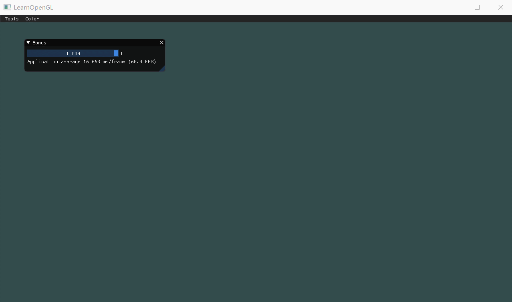

| 课程名称 | 计算机图形学 | 任课老师 | 高成英 |
| :------------: | :-------------: | :------------: | :-------------: |
| 年级 | 16级 | 专业（方向） | 软件工程（数字媒体）|
| 学号 | 16340255 | 姓名 | 谢涛 |
| 电话 | 13670828568 | Email | 1176748429@qq.com |
| 开始日期 | 2019-05-23 | 完成日期 | 2019-05-24 |

[TOC]

## Basic
1. 用户能通过左键点击添加Bezier曲线的控制点，右键点击则对当前添加的最后一个控制点进行消除。
2. 工具根据鼠标绘制的控制点实时更新Bezier曲线。

## Bonus
可以动态地呈现Bezier曲线的生成过程。 

## 作业要求 
1. 把运行结果截图贴到报告里，并回答作业里提出的问题。 
2. 报告里简要说明实现思路，以及主要function/algorithm的解释。 
3. 虽然learnopengl教程网站有很多现成的代码，但是希望大家全部手打，而不是直接copy。

## 效果


## 实现思路
Basic和Bonus分两部分实现。其中Basic部分计算函数表达式进而模拟曲线上任意一点，Bonus部分根据t计算切线交点的位置，并画出计算过程。可通过键盘输入控制t从而观察曲线生成过程。

### Basic部分
- 主体思路
```c++
void drawCurve() {	
	float t = 0;
	while (t < T) {
		t += 0.001;
		Point point = Q(t); // 函数表达式

		float p[2] = { point.x, point.y };
		float color[3] = { curve_color.x, curve_color.y, curve_color.z };
		drawPoint(p, color);
	}
}
```

- 函数表达式计算
```c++
Point Q(float t) {
	int n = points.size() - 1;
	float* B = new float[n + 1];	
	for (int i = 0; i <= n; i++) {
        // 这里把B拆成三个部分
		int a = comb(n, i); // 组合数部分
		float t1 = pow(t, i); // t指数部分
		float t2 = pow(1 - t, n - i); // (1-t)指数部分
		B[i] = a * t1 * t2;
	}

	Point result;
	result.x = 0;
	result.y = 0;
	for (int i = 0; i <= n; i++) {
		result.x += B[i] * points[i].x;
		result.y += B[i] * points[i].y;
	}
	delete B;
	return result;
}
```

- 组合数的计算进行了约分优化
```c++
int comb(int n, int k) {
	if (n == k || k == 0) return 1;

	// 约分后的分母
	int up = 1;
	int i = n;
	while (i > n - k) {
		up *= i;
		i--;
	}

	// 约分后的分子
	int down = 1;
	i = k;
	while (i > 0) {
		down *= i;
		i--;
	}
	return up / down;
}
```

### Bonus部分
**主体思路：递归画线，出口画点。**

简单解释一下：该递归函数接受控制点数组的输入，然后根据t计算辅助点在控制点连线上的位置，将新求得的辅助点作为下一轮的控制点丢进递归函数，每次递归辅助点个数会减少，直到最后辅助点个数只剩一个的时候，结束递归，此时的辅助点便是切线交点。
```c++
void drawBonus(vector<Point> v) {
	if (v.size() == 1) {
        // 画出切线交点
		float p[2] = { v[0].x, v[0].y };	
		float color[3] = { edge_color.x, edge_color.y, edge_color.z };
		drawPoint(p, color, 8.0);
		return;
	};
    
	vector<Point> v1;    
	for (int i = 0; i < v.size() - 1; i++) {		
        // 计算辅助点位置
		Point p;
		p.x = v[i].x + (v[i + 1].x - v[i].x) * T;
		p.y = v[i].y + (v[i + 1].y - v[i].y) * T;
		v1.push_back(p);
	}

	// 给辅助点连线
	for (int i = 0; i < v1.size() - 1; i++) {
		float p1[2] = { v1[i].x, v1[i].y };
		float p2[2] = { v1[i + 1].x, v1[i + 1].y };
		drawLine(p1, p2, 1.0);
	}

	drawBonus(v1);
}
```

为方便展示：实现了用键盘A或D键或左方向键<-或右方向键->控制t的值，查看曲线的生成过程。

## 主要的function/algorithm解释
- **glm::mat4(1.0f)。** 生成一个4*4的单位矩阵，用于配合后面的变换函数生成变换矩阵。
- **glm::translate(mat4, glm::vec3)。** 传入一个三维向量表示位移量，glm根据这个位移量，并在mat4的基础上，加入位移变换，生成新的矩阵并返回。
- **glm::perspective(mat4, width/height, near, far)。** 第一个参数是view矩阵，第二个参数是窗口的宽高比，前两个参数基本固定。后两个参数定义最近、最远能看到的平面的垂直距离。
- **glm::lookAt(position, target, up)。** 该函数可以产生一个效果是始终看着某一点的view矩阵。三个参数都是一个glm::vec3类型的向量，分别指定摄像机的位置、观察目标和上向量（用于定位摄像机的角度）。
- **glGetUniformLocation(shaderProgram, uniformName)。** 这个函数返回着色器程序中uniform变量的地址，如果没有找到返回-1。第一个参数是链接后的着色器程序的id（不是顶点着色器的id，一开始传错参数坑了很久）。第二个参数是要找的uniform变量的名称。
- **glUniformMatrix4fv(uniformLocation, count, transpose, address)。** 该函数的作用是对着色器程序中uniform变量的赋值。第一个参数是上个函数返回的uniform变量在着色器程序中的地址，第二个参数表示要改变的uniform变量的个数，传1表示要修改的uniform变量不是数组。第三个参数是布尔类型，指定传进去的变换矩阵是否要做转置。第四个参数则是要传进去的变换矩阵的地址。
- **glUniform3fv(uniformLocation, count, address)。** 类似上面的函数，不过是传一个三维的浮点数向量，不用指定transpose。
- **glUniform1fv(uniformLocation, count, address)。** 类似上面的函数，传一个一维的浮点数向量。
- **glUniform1iv(uniformLocation, count, address)。** 类似上面的函数，传一个一维的整数向量。
- 其他glUniform函数以此类推。